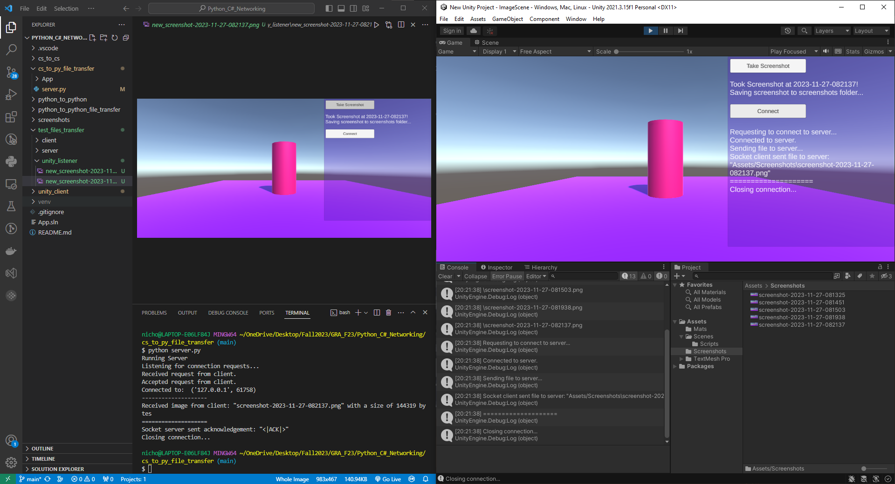
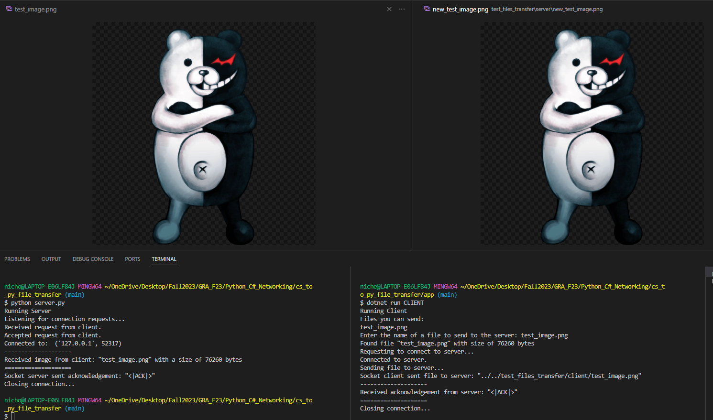
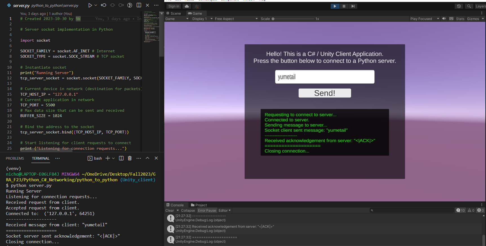
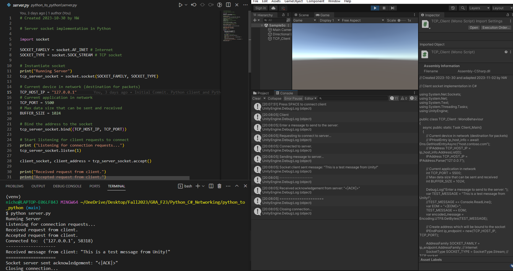
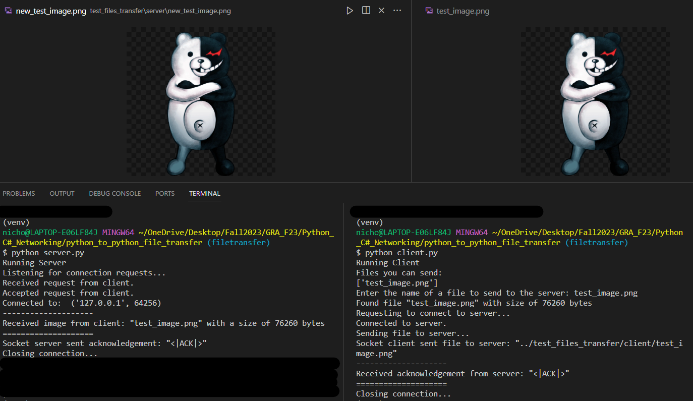
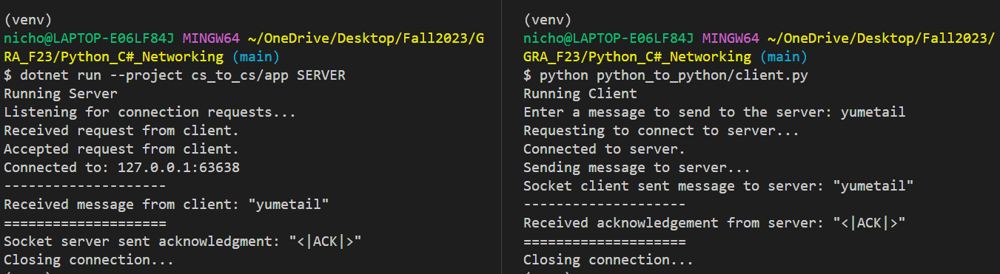
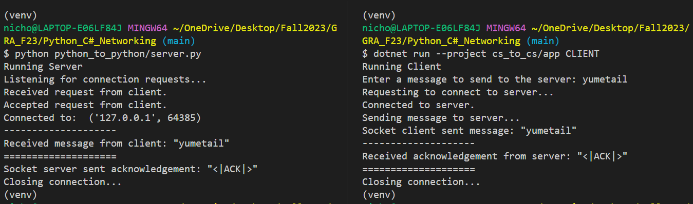
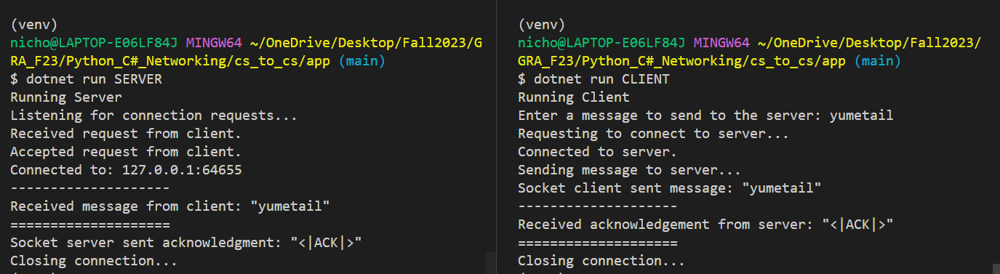
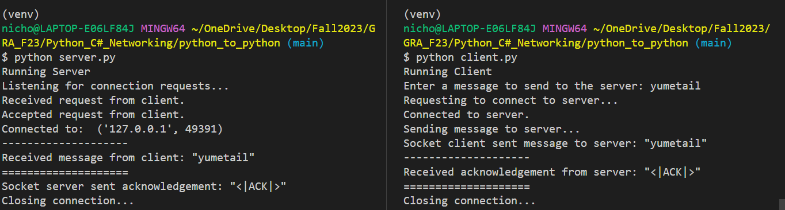

# Python-and-C-Sharp-Networking

Working on implementing TCP sockets for Inter-Process Communication (IPC) message passing between a Python server and a C# client. 

Eventually planning to host a pre-trained machine learning model on the Python server, and integrate the model into a Unity VR client application.

## Updates

### 2023-11-27
Implemented screenshot sharing between a C#/Unity client and a Python server.

### 2023-11-27
Implemented image file transfer between a C# client and Python server.

### 2023-11-02
Implemented Unity client interface to write a custom message to the Python server, and display what the Python server sent.

### 2023-11-02
Implemented connection between a C#/Unity client and a Python server.

### 2023-11-02
Implemented image file transfer between a Python client and Python server.

### 2023-10-30
Implemented connection between a Python client and C# server.

### 2023-10-30
Implemented connection between a C# client and Python server.

### 2023-10-30
Implemented connection between a C# client and C# server.

### 2023-10-30
Implemented connection between a Python client and Python server.
